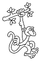

<html><head>
<title>Sam le chevalier sans cheval</title>
<link rel="stylesheet" type="text/css" href="../images/m.css">
</head><body>

<table width=100%><tr><td>
<table width=95%><tr><td>

 
<h1>8</h1>

Je prend une pomme dans le sac et je la tends au singe. Il s'approche pour la prendre. Alors j'ai une bonne chance d'attraper le médaillon avant que le singe ne se sauve plus haut dans l'arbre!

<table width=50% border=2 cellpadding=5><tr><td>
Il s'agit d'un défi d'agilité et la difficulté est de 7. Pour le réussir tu dois lancer 2 dés à six faces et additionner le résultat des dés.
</td></tr></table>

<h3>

<a  href="22.html">Si le total des dés est de 7 ou plus, j'ai réussi à attraper le médaillon, rends-toi au  22.</a>

<a  href="13.html">Si le total des dés est de 6 ou moins, le singe a été plus rapide que moi et il est maintenant hors de portée, rends-toi alors au  13.</a>
</h3></td></tr></table>
</td></tr></table>

<body>
