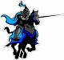

<html><head>
<title>Sam le chevalier sans cheval</title>
<link rel="stylesheet" type="text/css" href="../images/m.css">
</head><body>

 
<h1>108</h1>

Après avoir marché pendant un certain temps, j'arrive à l'orée de la forêt. Maintenant, une grande prairie me sépare d'autres collines au loin.
Je cherche un grand arbre afin d'y grimper pour avoir la meilleure vue possible.
Droit devant moi, je peux voir un somptueux manoir, seul sur le sommet d'une colline. Il doit sûrement y avoir un noble seigneur qui y habitent! Peut-être acceptera-t-il de m'aider.
À ma gauche, j'aperçois entre les vallons une petite hutte en paille et en bois. Je ne sais pas qui peut bien habiter là. Sans doute un pauvre paysan.
Si je regarde vers la droite, je vois au loin une étrange tour en pierre à la forme plutôt inquiétante. La personne qui reste dans cette tour a vraiment de bien drôles de goûts en architecture.

<h3>

<a  href="15.html">Si tu crois que je devrais me rendre au manoir, rends-toi au 15.</a>

<a  href="35.html">Si tu penses que je dois aller voir qui habite dans la hutte, va au 35.</a>

<a  href="26.html">Peut-être que je pourrais aller visiter cette étrange tour. Rends-toi au 26.</a>

<a  href="128.html">Note: Lorsque tu auras visité ces trois lieux, rends-toi au 128.</a>
</h3>

<body>
